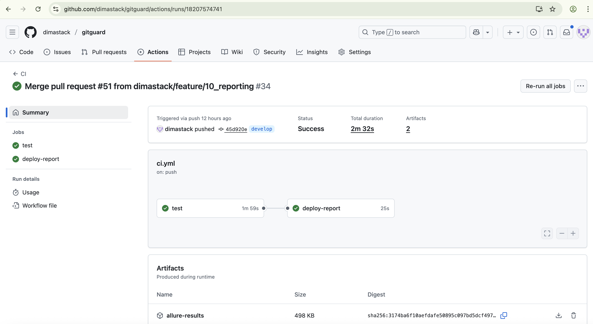
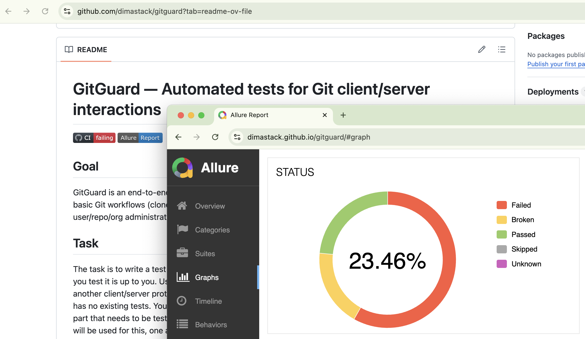

# GitGuard — Automated tests for Git client/server interactions

[](https://github.com/dimastack/gitguard/actions/workflows/ci.yml)
[](https://dimastack.github.io/gitguard/)

## Goal
GitGuard is an end-to-end testing framework for Git client ↔ Git server interactions.
It focuses on verifying the basic Git workflows (clone, commit, push, pull, branch, fetch, status) and the server API (Gitea) behavior for user/repo/org administration.

## Task
The task is to write a test or set of tests that test the Git software. You are free to use available
frameworks; how you test it is up to you. Use your best judgment!
If you don’t have any experience with Git, feel free to choose another client/server protocol (for
example, HTTP or FTP) and test this instead.
You can assume that the software has no existing tests. Your task is to select the areas that
must be tested first and implement these. One important part that needs to be tested is
communication between a Git client and a Git server (we can assume that two hosts will be
used for this, one acting as a client and one as a server).
We are not looking for complete coverage but tests that implement the basics. You can take
shortcuts where a certain implementation would take a long time. In this case, describe how the
solution would be implemented instead.
After the basic set of tests has been implemented, describe what the second phase of the test
implementation would be, and also describe the requirements of the system that would run
these tests in a continuous integration manner.

## Preparation and thoughts
Homemade solution:

Initially, I had another plan: I wished to run Git client on local VM (CI runner) and run Git server (Gitea) inside the Docker. This way on CI I planned to use different runner OS's to run
the tests via matrix 'OSs/git client versions/protocols'. But in such case I was made to work via
localhost which technically break task requirements.
So in the result I decided to orginize infrastructure as 2 Docker containers connected via network in bridge mode - means 2 different hosts with 2 different IPs.
I tried to complete the task as complex solution with unit tests, e2e, clients, infrastructure.

Real life solution:

In case I need to test Git clients and server in reality, I'd preffered next way:
1) Separate dev teams works on each version of Git client (per OS) and one team works with server code.
2) All the teams write unit tests (I added them here just to show they should be absolutely required as stage 0)
3) We deploy server code on test environment somewhere in eg AWS.
4) I use let's say Github Actions or Gitlab CI to run tests from Runner VM with different OS's with installed python and git clients in the matrix against Git server running on AWS.

## Why two-container architecture
We must test communication between **two separate hosts** — a Git client and a Git server — to match the assignment requirements. Running both roles in different Docker containers (`tester` and `gitea`) gives:
- deterministic networking (services communicate by DNS in the compose network),
- reproducible test environments (same image used locally and in CI),
- ability to vary client git versions by building different tester images,
- isolation: tester contains git + python + tests, gitea contains server only.

## Architecture

```
+----------------------+        docker network         +----------------------+
|   tester (container) | <---------------------------> |  gitea (container)   |
|  - python, pytest    |                               |  - Gitea server      |
|  - git               |                               |  - API (http/ssh/git)|
|  - tests (pytest)    |                               |                      |
+----------------------+                               +----------------------+
            |                                                   |
            |   Allure results (volume)                         |
            |-- ./allure-results <------------------------------|
```

## Features

- **Docker Compose setup** with `gitea` and `tester` services
- **Pytest integration** with Allure for structured reports
- **GitHub Actions CI** workflow:
  - Runs tests inside the `tester` container
  - Collects and uploads Allure results as artifacts
  - Publishes the Allure Report to GitHub Pages

## Project structure (important)
```
gitguard/
├─ .github/
│  └─ workflows/
│     └─ ci.yml
├─ artifacts/
├─ docker/
│  └─ tester/
│     └─ Dockerfile
├─ scripts/
│  ├─ init_gitea.sh
│  ├─ init_ssh_keys.sh
│  └─ wait_for_gitea.sh
├─ src/
│  └─ gitguard/
│     ├─ clients/
│     │  ├─ __init__.py
│     │  ├─ git_client.py
│     │  ├─ http_client.py
│     │  ├─ http_gitea_client.py
│     │  └─ ssh_client.py
│     └─ __init__.py
├─ tests/
│  ├─ e2e/
│  │  ├─ api/
│  │  │  ├─ cli/
│  │  │  │  ├─ conftest.py
│  │  │  │  ├─ test_branching.py
│  │  │  │  ├─ test_clone.py
│  │  │  │  ├─ test_full_flow.py
│  │  │  │  ├─ test_init_commit.py
│  │  │  │  ├─ test_log_diff_reset_stash.py
│  │  │  │  ├─ test_merge_rebase.py
│  │  │  │  ├─ test_push_pull.py
│  │  │  │  ├─ test_remote_config.py
│  │  │  │  ├─ test_status_fetch.py
│  │  │  │  └─ test_tags.py
│  │  │  └─ server/
│  │  │     ├─ conftest.py
│  │  │     ├─ test_admin_e2e.py
│  │  │     ├─ test_health_misc_e2e.py
│  │  │     ├─ test_orgs_e2e.py
│  │  │     ├─ test_repos_e2e.py
│  │  │     └─ test_users_e2e.py
│  │  └─ ui/
│  │     └─ conftest.py
│  ├─ unit/
│  │  ├─ cli/
│  │  │  ├─ test_git_general.py
│  │  │  ├─ test_git_pull.py
│  │  │  └─ test_git_push.py
│  │  └─ server/
│  │     ├─ test_admin.py
│  │     ├─ test_misc.py
│  │     ├─ test_orgs.py
│  │     ├─ test_repos.py
│  │     └─ test_users.py
│  └─ conftest.py
├─ .gitignore
├─ docker-compose.yml
├─ Makefile
├─ pytest.ini
├─ README.md
└─ requirements.txt

```

## How tests are organized
- `tests/unit` — unit tests
- `tests/e2e/api/cli` — e2e scenarios using `GitClient` (clone/commit/push/pull/branch/status/fetch)
- `tests/e2e/api/server` — e2e scenarios using `GiteaHttpClient` (users, repos, orgs, admin)
- `tests/e2e/ui` — (future) UI tests (Playwright)

## Quickstart (local)
1. Install Docker & docker-compose.
2. Build tester image from docker/tester/Dockerfile:
   ```bash
   docker compose build --no-cache tester
   ```
3. Start stack:
   ```bash
   docker compose up -d gitea
   bash scripts/wait_for_gitea.sh
   docker compose up -d tester
   docker exec tester bash -lc "/app/scripts/init_gitea.sh"
   ```
4. Run tests inside tester:
   ```bash
   docker exec tester pytest -v --alluredir=/app/allure-results tests/unit
   docker exec tester pytest -v --alluredir=/app/allure-results tests/e2e/api
   ```
5. Generate Allure report:
   ```bash
   allure generate allure-results -o allure-report --clean
   allure open allure-report
   ```

## CI — high level

- Workflow builds tester image, brings up gitea first, waits for readiness (via scripts/wait_for_gitea.sh), then starts tester.
- Tests run inside tester via docker exec.
- Allure results are collected from /app/allure-results and uploaded as artifacts; an additional job generates Allure HTML and publishes it to GitHub Pages.

- The test step is continue-on-error (or tolerant) and artifact + report steps are if: always() — this ensures we always publish report even if tests fail.
- Matrix: CI can run multiple matrix entries (different git versions) — for containerized runs this is typically implemented by building tester images with different build args/tags.

## What was tested first (MVP)
- Core Git operations (clone, init, add, commit, push, pull, fetch, branch, checkout, status).
- Gitea API: create/delete users, create/delete repos, list orgs, admin endpoints.
- Communication between client and server over supported protocols (http, ssh, git).
- Basic negative scenarios (invalid repo, non-existent user, invalid payload).

## Shortcuts / assumptions
- We use Gitea for server; initialization is best-effort by `init_gitea.sh`. On CI pass `GITEA_ADMIN_TOKEN` to allow API-based setup.
- SSH keys are generated at start and shared between tester and gitea (via scripts/compose). This is implemented as a best-effort in `init_gitea.sh` and docker-compose mounts.

## Second phase (roadmap)
1. **Expand test coverage**: add edge cases, parallel pushes, large-file pushes, submodules.
2. **Performance & stress**: scripted parallel pushes/fetches, large repos, measure latencies.
3. **UI tests**: Playwright tests for login / repo creation / web UI flows.
4. **Security tests**: RBAC, token expiry, CSRF, input validation fuzzing.
5. **Chaos testing**: network partition, disk I/O throttle, restart gitea during push.
6. **Matrix builds**: add multiple tester images (different Git versions) and runner targets (Linux/macOS/Windows).

## Infra requirements
- Docker & docker-compose available (for running services).
- Secrets access for `GITEA_ADMIN_TOKEN`.
- Optionally Allure CLI installed to publish HTML report.
- Runners for UI tests don't require browser support as will be executed in --headless (Playwright).

## Troubleshooting (common problems & fixes)

- Gitea HTTP not responding (wait_for_gitea.sh times out)
Check docker logs gitea.
Ensure container had time for initialization (DB migrations). Increase retries in scripts/wait_for_gitea.sh.
- SSH port conflict (listen tcp :22: bind: address already in use)
Host may already have SSH on port 22. Use a different host port mapping (compose uses 2222:2222 recommended). Verify GITEA__server__SSH_PORT env in compose.
- ModuleNotFoundError: No module named 'clients' inside tester
Ensure PYTHONPATH=/app is exported in tester env and tests volume mounting is correct. requirements.txt must be installed in the tester image.
- Permissions when copying Allure artifacts on CI
Fix by making copied dir world-writable before upload: sudo chown -R $USER:$USER ./allure-results && sudo chmod -R 777 ./allure-results (CI runner).
- allure: command not found when generating report on GitHub runner
Install Allure CLI explicitly in the job (download exact release releases/download/<version>/allure-<version>.tgz) and symlink to /usr/local/bin/allure.
- If Allure report folder missing for Pages upload
Make sure allure generate ran successfully and the directory exists before upload-pages-artifact. Use if: always() and || true for resilience and check logs.
